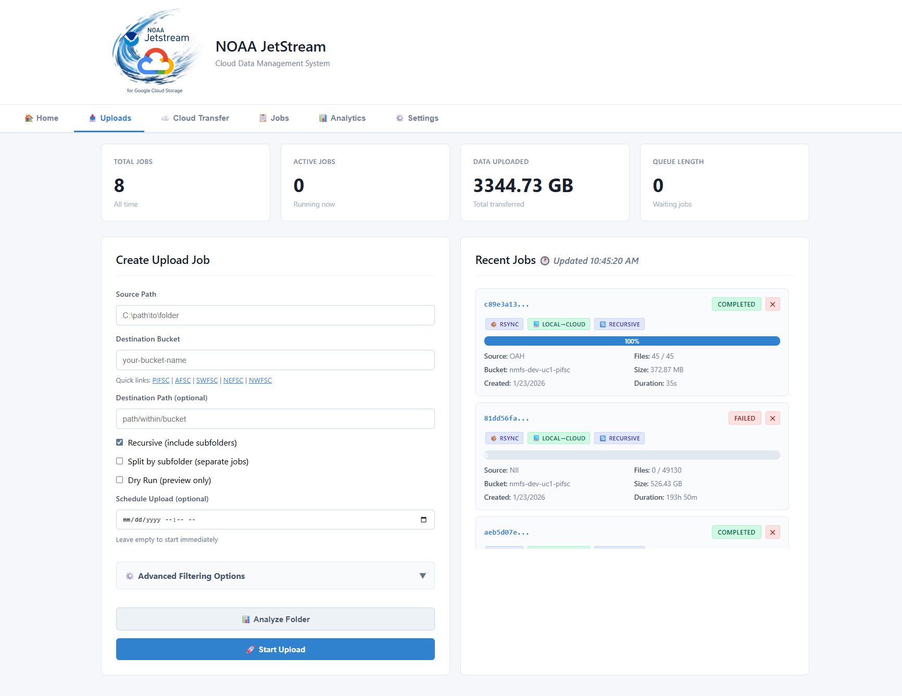

# NOAA Cloud Migration Toolkit

Lightweight Open Source Python tools for working with folders and migrating scientific data to the cloud.

- Contact: Data Services Team
### Table of Contents
1. [Folder Stats Tool](#folder-stats-tool)
2. [Data Tracker Tool](#data-tracker)
3. [Data Cleaner Tool](#data-cleaner-tool)
4. [Data Upload Tool](#data-upload-tool)

<a href=""></a>


#### 1. Folder Stats Tool

The Folder Stats Tool scans the immediate subdirectories of a selected folder or mapped drive and exports their statistics to a CSV file.

- Recursively calculates folder sizes in TB, GB, and MB.
- Optionally counts files and subfolders.
- Processes top-level folders in parallel.
- Saves the CSV report in the selected folder.

#### Install
Clone the repository and change to its directory:
```
git clone https://github.com/noaa-pifsc/esd-cloud-migration-toolkit.git
cd esd-cloud-migration-toolkit
```

```cmd
pip install -r requirements.txt
```

#### Start the App

```
python folder_stats_2026_multi.py
```

Choose the folder or mapped drive to scan. The tool reports each immediate subfolder and writes a timestamped `*_network_folder_stats.csv` file to the selected location. Enable **Include file/folder count** to calculate counts as well as sizes; leave it unchecked for size-only scanning. Adjust **Number of parallel threads** if needed.


### 2. Data Tracker
- [PIFSC ESD ARP Google Sheet Migration Tracker](https://docs.google.com/spreadsheets/d/1SSP4OPzdc-uV8sBvzbyEM-jg4IpOI6xbK7ahS5Dm4ig)

### 3. Data Cleaner
### Placeholder

<a href=""></a>


### 4. Data Upload Tool

- [Jetstream](https://github.com/MichaelAkridge-NOAA/jetstream) — upload data to Google Cloud Storage.

#### Install
```
pip install noaa-jetstream
```
#### Run Jetstream

```
jetstream
```


## 5. Bucket Network Folder Mount Tool

## 5. Placeholder

#### License

See [LICENSE.md](./LICENSE.md) for details.

#### Disclaimer

This repository is a scientific product and is not official communication of the National Oceanic and Atmospheric Administration, or the United States Department of Commerce. All NOAA GitHub project code is provided on an “as is” basis and the user assumes responsibility for its use. Any claims against the Department of Commerce or Department of Commerce bureaus stemming from the use of this GitHub project will be governed by all applicable Federal law. Any reference to specific commercial products, processes, or services by service mark, trademark, manufacturer, or otherwise, does not constitute or imply their endorsement, recommendation or favoring by the Department of Commerce. The Department of Commerce seal and logo, or the seal and logo of a DOC bureau, shall not be used in any manner to imply endorsement of any commercial product or activity by DOC or the United States Government.
