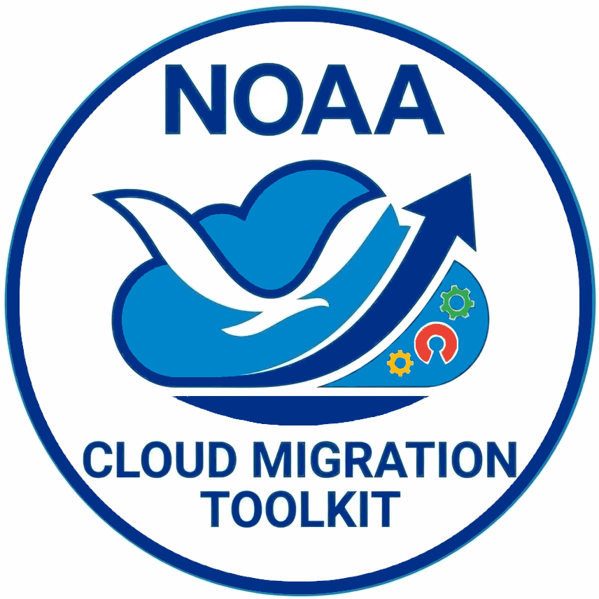
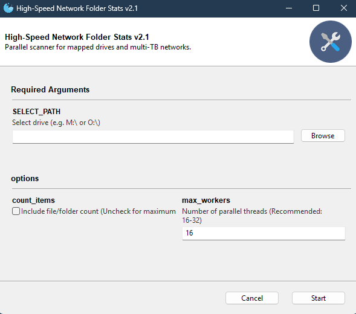

# NOAA-NMFS Cloud Migration Toolkit

<a href=""></a>
Lightweight tools and practical starting points for moving scientific data to the cloud, managing it there, and accessing it from your computer.

## Contents

- [Move Data to the Cloud](#move-data-to-the-cloud)
- [Work with Data in the Cloud](#work-with-data-in-the-cloud)
- [Use Cloud Data Locally](#use-cloud-data-locally)
- [Choose a Tool](#choose-a-tool)
- [Folder Stats Quick Start](#folder-stats-quick-start)
- [External Tools](#external-tools)
- [Planned Tools](#planned-tools)
- [Help](#help)
- [License](#license)
- [Disclaimer](#disclaimer)

## Move Data to the Cloud

Start here if your data is on a computer, shared drive, or external disk.

1. **Inventory your data.** Use [Folder Stats](#folder-stats-quick-start) to estimate subfolder sizes and optionally count files. Identify what needs to move and what should stay local.
2. **Choose the destination.** Google Drive is for file sharing and collaboration; Google Cloud Storage (GCS) stores objects in buckets for data storage and workflows. They are separate services with different access and setup requirements. Confirm the destination is appropriate for your data and your team's policies.
3. **Prepare and transfer.** Use the [File Copy Tool](#file-copy-tool) when you need to stage files locally or moving to Google Shared Drive. Use [NOAA Jetstream](#noaa-jetstream) for GCS uploads, or review [Local Drive Backup](#local-drive-backup) for selected code/project files copied to a Google Drive-synced destination.
4. **Verify after Upload.** Review transfer logs and failures, compare the expected files with the destination, and use checksum verification where supported. Keep source data until verification and retention requirements are satisfied. A folder-size report alone does not prove a successful transfer.

Before a large transfer, confirm permissions, storage capacity, and likely costs, and try a small representative dataset first.

## Work with Data in the Cloud

Start here if your data is already in a GCS bucket and you need to browse or organize it.

- **Browse, Move, rename, sync, aduit bucket contents and monitor uploads:** see [NOAA Jetstream](#noaa-jetstream).
- **Simple Move or rename cloud objects:** see the [GCS Move and Rename Tool](#gcs-move-and-rename-tool). It runs on your Windows computer but performs cloud operations without downloading and re-uploading the data locally.

Cloud objects do not always behave like files on a local disk. Check destination paths, overwrite behavior, required permissions, and cost warnings before moving or renaming data; do not assume a move is instantaneous or atomic. Avoid large reorganizations through a mounted drive without checking how the mount handles them.

**Current scope:** this collection covers data transfer, access, and management. It does not yet provide a guide or environment for running analyses, notebooks, or other computing jobs in the cloud.

## Use Cloud Data Locally

Start here if you want to use cloud data with applications on your computer.

| Approach | When It Helps | Keep in Mind |
| --- | --- | --- |
| Mount cloud storage as a drive/folder | Browse and access cloud files through local applications; see [rclone Mount](#rclone-mount). | Uncached access needs a network connection. Application compatibility and write behavior depend on caching and configuration. |
| Download a local copy | Work offline or repeatedly process the same files. | You need local disk space; your copy does not automatically receive cloud changes. |
| Synchronize copies | Keep selected local and cloud locations aligned using a configured sync tool. | Check direction, exclusions, and deletion rules. Sync can propagate unwanted changes and is not a backup by itself. |

A mount is not a full offline copy or a backup. Reads, writes, and repeated scans can generate cloud requests and transfer costs. For offline work, explicitly download the files you need; do not rely on a mount's cache. See the upstream tool documentation for download and sync setup.

## Choose a Tool

**Included** means the tool is in this repository. **External** means follow the linked project's setup instructions separately.

| I Need To... | Tool / Setup | Data Location | Availability |
| --- | --- | --- | --- |
| Estimate subfolder sizes and counts | [Folder Stats](#folder-stats-quick-start) | Local folder or mapped drive | Included |
| Copy or stage folders | [File Copy Tool](#file-copy-tool) | Local or accessible filesystem paths | External |
| Schedule selected code/project backups | [Local Drive Backup](#local-drive-backup) | Local to a synced folder, such as Google Drive | External |
| Upload data and browse buckets | [NOAA Jetstream](#noaa-jetstream) | Local to GCS; also offers Drive transfers | External |
| Move or rename GCS objects | [GCS Move and Rename Tool](#gcs-move-and-rename-tool) | Within/between GCS buckets | External; Windows |
| Access cloud storage as a local drive | [rclone Mount](#rclone-mount) | Cloud accessed locally | External |

## Folder Stats Quick Start

Folder Stats is a desktop app that scans each immediate subfolder of a selected folder or mapped drive, recursively calculates its size, and saves one CSV row per subfolder. It does not upload data or require a cloud account.

### Before You Start

- A Python installation with `pip`, and a graphical desktop to display the app. If needed, start with the [Python installation guide](https://www.python.org/about/gettingstarted/).
- [Git](https://git-scm.com/downloads) for the clone instructions below. Alternatively, use GitHub's **Code > Download ZIP**, extract it, and open a terminal in the extracted repository folder.
- Permission to read the folders being scanned **and write a report in the selected folder**. The output location is not configurable.

A tested Python-version and operating-system compatibility matrix is not yet documented for Folder Stats. Its desktop interface uses Gooey; installation depends on GUI dependencies being available for your environment.

### Install and Launch

Open a terminal (PowerShell or Command Prompt on Windows, or Anaconda Prompt if you use Anaconda). Use the same Python environment for installation and launch. A dedicated environment is preferable if you already use Python for other projects.

If using Git, run these commands one at a time:

```shell
git clone https://github.com/noaa-pifsc/esd-cloud-migration-toolkit.git
cd esd-cloud-migration-toolkit
```

From the repository folder, install dependencies and start the app:

```shell
python -m pip install -r requirements.txt
python folder_stats_2026_multi.py
```

These commands install and launch **Folder Stats only**. They do not install the external tools.

### Run a Scan

1. Choose the folder or mapped drive you want to scan using the folder chooser.
2. Enable **Include file/folder count** if you need counts. Leave it unchecked for size-only output; counts will show `N/A`.
3. Start with the default **Number of parallel threads** value of **16**. Use a positive whole number; lower it if the scan puts too much load on a shared drive.
4. Click **Start** and wait for **Network Scan Complete** in the output.
5. Open the CSV in the selected folder using a spreadsheet application or text editor.



### Find and Read Your Report

The UTF-8 CSV is saved inside the folder you selected, with a name such as `10_02_2026_1430_network_folder_stats.csv`. The filename uses the scan start time, in `MM_DD_YYYY_HHMM` format.

| CSV Fields | Meaning |
| --- | --- |
| Path | Immediate subfolder being summarized. |
| Created Date, Last Modified Date | Dates for that subfolder, not every file inside it. Creation date may fall back to modification time on some systems. |
| Scan Date | Time the scan started. |
| Size (TB), Size (GB), Size (MB) | Recursive file sizes using powers of 1024, despite the TB/GB/MB labels; these may differ from decimal storage figures. |
| File Count, Folder Count | Recursive counts inside the subfolder, or `N/A` when counting is disabled. The summarized subfolder itself is not included in Folder Count. |

### Limitations to Know

- Files directly inside the selected root folder are **not included**. Only its immediate subfolders get report rows.
- Permission-denied entries can be silently skipped, so a completed scan can still have incomplete totals. Confirm access before using the report for migration planning.
- If there are no immediate subfolders, the app prints **No sub-directories found** and does not create a CSV.
- Two scans of the same folder started within the same minute use the same filename and can overwrite the earlier report. Rename or move a report you need to preserve before scanning again.
- Treat reports as potentially sensitive: they contain filesystem paths. Check them before sharing.

## External Tools

These projects are not bundled here. Use their own documentation for current releases, supported platforms, installation, authentication, and troubleshooting. Installing a tool does not automatically grant access to cloud data.

### File Copy Tool

**Use for:** copying files and directories between accessible filesystem locations, including staging data before an upload.

The Archive Toolbox's Windows robocopy-based tool supports parallel copying, skipping existing destination files, and restarting interrupted transfers. The project also lists multiplatform variants; choose the version appropriate for your system. Skipping an existing file is not proof that its contents match the source. This is not, by itself, a direct Google Drive or GCS upload client.

**Setup:** [Archive Toolbox documentation](https://github.com/MichaelAkridge-NOAA/archive-toolbox).

### Local Drive Backup

**Use for:** scheduled copies of selected code/project files to a synced destination, such as a folder managed by Google Drive for Desktop.

The primary setup uses Windows batch scripts, robocopy, and Task Scheduler; the project also provides a Bash/rsync alternative. Configure source and destination paths and ensure your destination's cloud-sync client is connected.

**Important:** the documented exclusions include `*.csv`, `*.jpg`, logs, Git folders, and environment/dependency folders. Review and adapt exclusions before use. The default configuration is **not a complete backup of scientific datasets**, and a completed local copy does not prove the cloud sync has finished.

**Setup:** [Local Drive Backup documentation](https://github.com/SamuelChiu-PIFSC/Local_Drive_Backup).

### NOAA Jetstream

**Use for:** GCS uploads, upload-job monitoring, and bucket browsing/analysis. The project also offers Google Drive transfers with separate OAuth setup.

The upstream guide lists Python 3.9 or newer on Windows 10 or later, macOS, or Linux. GCS features require the Google Cloud SDK, an authenticated account, and permissions on the target bucket. Follow the upstream prerequisites before installing:

```shell
python -m pip install noaa-jetstream
jetstream
```

Jetstream starts a local web dashboard and normally opens your browser. Keep the launch terminal open while using it; press `Ctrl+C` there to stop it.

**Setup:** [NOAA Jetstream documentation](https://github.com/MichaelAkridge-NOAA/jetstream), including authentication and Google Drive setup links.

### GCS Move and Rename Tool

**Use for:** moving or renaming GCS objects through a Windows PowerShell/WinForms interface without mounting a bucket or transferring the data through your computer.

Requires the Google Cloud CLI (`gcloud`) on your system, authentication, and permissions to list/read/create/delete affected objects and retrieve bucket metadata. The app provides cost warnings and operation logs. Review source and destination paths and test a small operation first.

**Setup:** [GCS Move and Rename Tool documentation and release link](https://github.com/DanWoodrichNOAA/GCS_Move_Rename_Tool/tree/main).

### rclone Mount

**Use for:** exposing cloud storage as a drive or folder that local applications can access.

rclone mount supports Windows, macOS, Linux, and FreeBSD, with platform-specific filesystem dependencies. On Windows, install **WinFsp** as well as rclone. Configure and test the cloud connection using the upstream guide before mounting it.

Check the guide's **Limitations** and **VFS File Caching** sections before editing files through a mount. Many applications need write caching; pending writes must finish uploading before you treat them as safely stored in the cloud. Consider read-only access when you only need to inspect data.

**Setup:** [rclone mount documentation](https://rclone.org/commands/rclone_mount/) and [WinFsp for Windows](https://github.com/winfsp/winfsp).

## Planned Tools

These entries are not available through this collection yet:

- **Migration Tracker:** PIFSC ESD ARP Google Sheet migration tracker; access/setup link pending.
- **Data Cleaner:** tool and setup details pending.

## Help

### Folder Stats Troubleshooting

| Problem | What to Check |
| --- | --- |
| `python` is not recognized | Confirm Python is installed and available in your terminal. If using Anaconda, open Anaconda Prompt and activate the environment you intend to use. |
| `No module named gooey` or dependency installation fails | Run `python -m pip install -r requirements.txt` from this repository in the same environment used to launch the app. For GUI dependency errors, keep the full error message for support. |
| App cannot access the selected folder | Confirm the path exists, the mapped drive is connected, and your account can list its contents. |
| Report cannot be written | You need write permission in the selected root folder; there is no separate output-folder setting. Ask the folder owner for appropriate access. |
| No CSV appears | Check the app output for errors or **No sub-directories found**. The report is saved in the selected folder, not necessarily the repository folder. |
| Totals are smaller than expected | Check unreadable folders and root-level files, which are excluded. Compare the report scope and binary size units with your other measurements. |

For toolkit questions or suggestions for the collection, contact the [PIFSC ESD Data Services Team](mailto:nmfs.pic.credinfo@noaa.gov). Include the tool name, operating system, what you tried, and a sanitized error message. Do not send passwords, authentication tokens, or sensitive paths/data.

For external-tool issues, start with that project's documentation and issue tracker.

## License

See [LICENSE.md](./LICENSE.md) for details.

## Disclaimer

This repository is a scientific product and is not official communication of the National Oceanic and Atmospheric Administration, or the United States Department of Commerce. All NOAA GitHub project code is provided on an “as is” basis and the user assumes responsibility for its use. Any claims against the Department of Commerce or Department of Commerce bureaus stemming from the use of this GitHub project will be governed by all applicable Federal law. Any reference to specific commercial products, processes, or services by service mark, trademark, manufacturer, or otherwise, does not constitute or imply their endorsement, recommendation or favoring by the Department of Commerce. The Department of Commerce seal and logo, or the seal and logo of a DOC bureau, shall not be used in any manner to imply endorsement of any commercial product or activity by DOC or the United States Government.